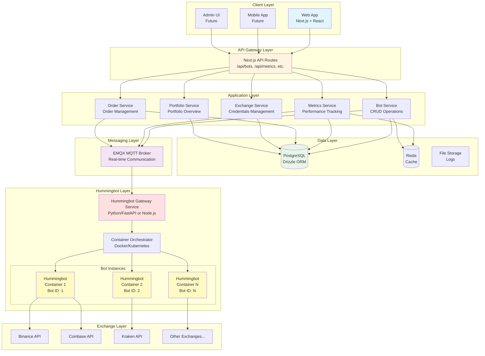
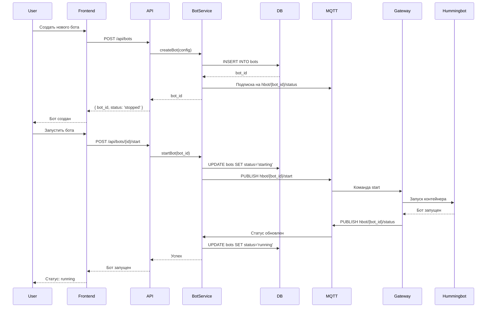
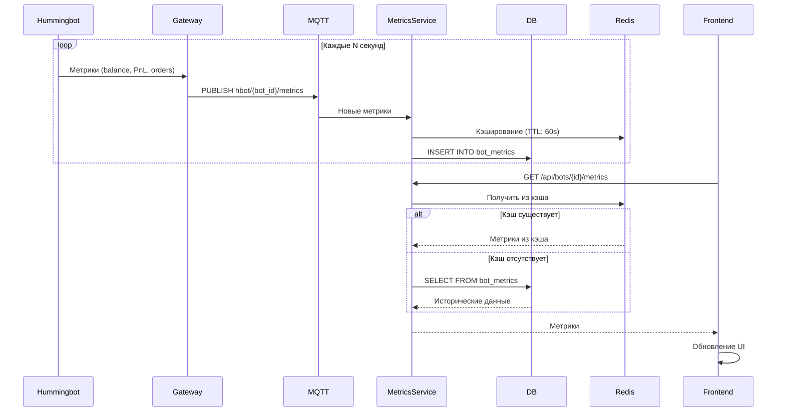
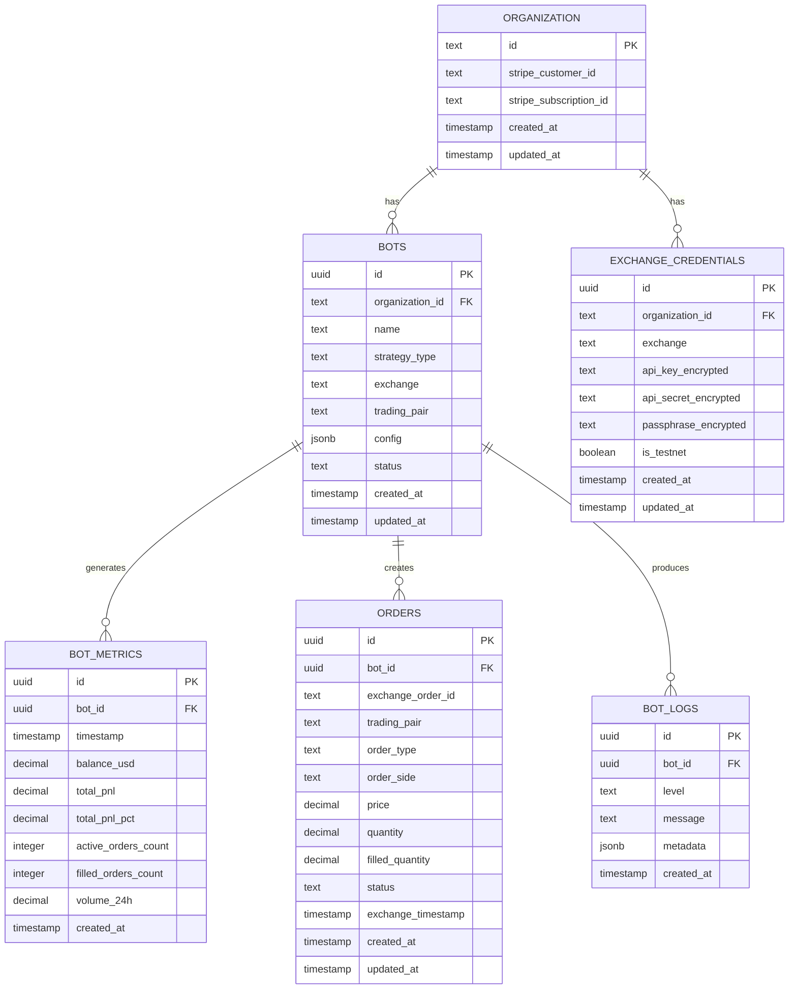
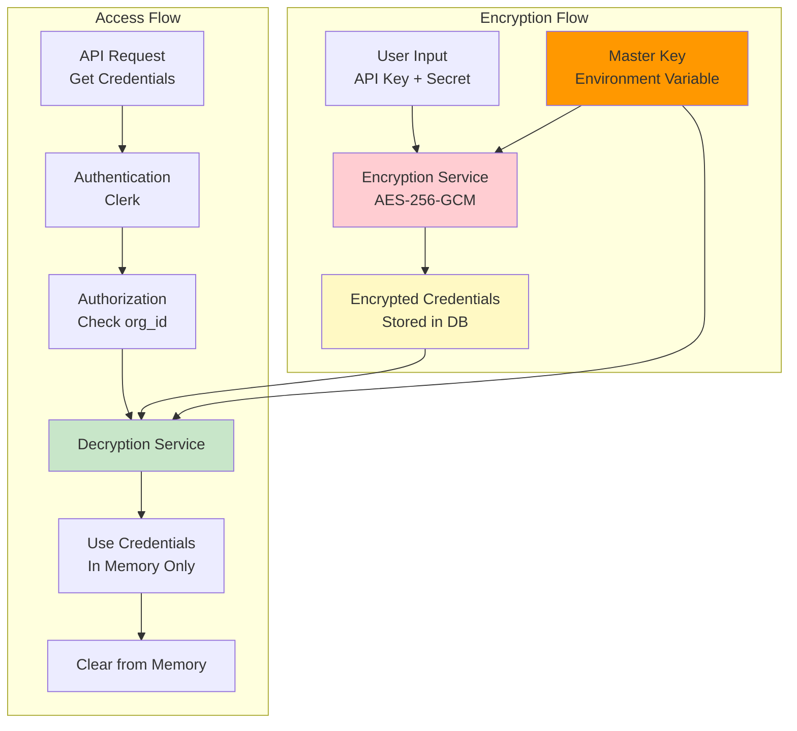
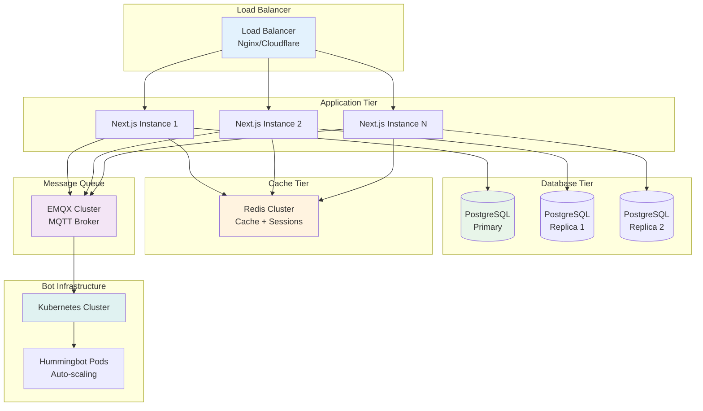
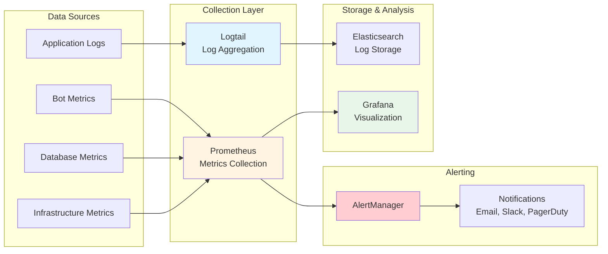

# Архитектура интеграции Hummingbot в Janym.io

## Общая архитектура системы



## Поток данных: Создание и запуск бота



## Поток данных: Сбор метрик



## Схема базы данных



## MQTT топики и подписки

```mermaid
graph LR
    subgraph "SaaS публикует"
        START[hbot/{bot_id}/start]
        STOP[hbot/{bot_id}/stop]
        CONFIG[hbot/{bot_id}/config/update]
    end

    subgraph "Hummingbot публикует"
        STATUS[hbot/{bot_id}/status]
        METRICS[hbot/{bot_id}/metrics]
        ORDERS_NEW[hbot/{bot_id}/orders/new]
        ORDERS_FILLED[hbot/{bot_id}/orders/filled]
        LOGS[hbot/{bot_id}/logs/+]
    end

    subgraph "SaaS подписывается"
        SUB_STATUS[hbot/+/status]
        SUB_METRICS[hbot/+/metrics]
        SUB_ORDERS[hbot/+/orders/+]
        SUB_LOGS[hbot/+/logs/+]
    end

    START --> MQTT[MQTT Broker<br/>EMQX]
    STOP --> MQTT
    CONFIG --> MQTT

    MQTT --> STATUS
    MQTT --> METRICS
    MQTT --> ORDERS_NEW
    MQTT --> ORDERS_FILLED
    MQTT --> LOGS

    STATUS --> SUB_STATUS
    METRICS --> SUB_METRICS
    ORDERS_NEW --> SUB_ORDERS
    ORDERS_FILLED --> SUB_ORDERS
    LOGS --> SUB_LOGS

    style START fill:#c8e6c9
    style STOP fill:#ffcdd2
    style STATUS fill:#fff9c4
    style METRICS fill:#e1bee7
    style MQTT fill:#bbdefb
```

## Компоненты безопасности



## Масштабирование и производительность



## Мониторинг и алертинг


